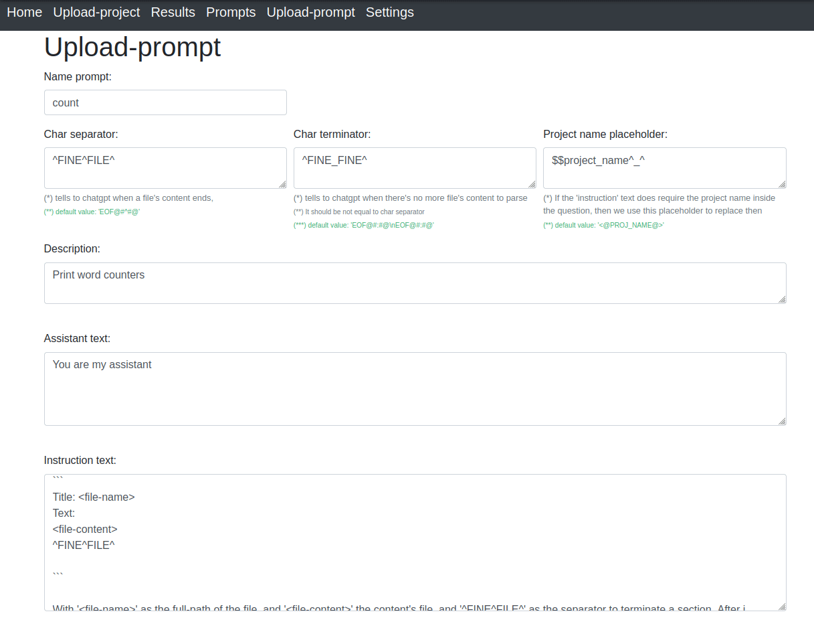
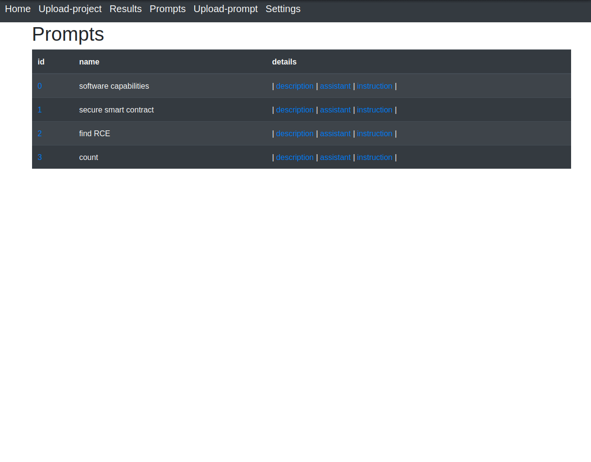

## Prompt Details

A prompt model is composed of two element, the assistant text and the instruction text:
 - Assistant text : is the role you give to chatgpt, e.g. "You are a talented poet, and now you are my assistant."
 - Instruction text : It does describe the problem you want to solve. It can be seen as a model, and so by words you're defining the system and the solutions


1. Upload a prompt

 - `Prompt name` and `Description` : Name and description of the prompt you're uploading
 - `Char separator` : tells to chatgpt when a file's content ends and a new one starts
 - `Char terminator` : tells to chatgpt when there's no more file's content to parse, It should be not equal to char separator 
 - `Project name placeholder` : if the instruction text requires the project name we add it by a placeholder which we'll then replace, see the example below
 - `Blacklist words` : Skip files containing blacklist words and also insert a counter (default: 1) to set a tollerance range per blacklist word


<br />

2. Example (1/2)

 - Please not the \``` blockline cant be rightly escaped inside a blockline, so you should remove the backslash that you see on 'Instruction text:' section (e.g  \\\```)

```
Name prompt: 
count

Char separator: 
^FINE^FILE^

Char terminator: 
^FINE_FINE^

Project name placeholder: 
$$project_name^_^

Assistant text:
You are my assistant

Instruction text:
I am inspecting the files of the project "$$project_name^_^". From now and on, I will upload the file's content as follows:

\```
Title: <file-name>
Text:
<file-content>
^FINE^FILE^

\```

With '<file-name>' as the full-path of the file, and '<file-content>' the content's file, and '^FINE^FILE^' as the separator to terminate a section. After i ended to upload files i will send the line:

\```
^FINE_FINE^
\```

After i do that you should print the word counter for each word.
```



<br />

2. Example (2/2)

Let's try the prompt (example [Chat.zip](../use_cases/word_counter.py_tests/Chat.zip))

Note: The output is limited, as already discussed in the section [notes](./notes.md), you should implement a reverse proxy instead of using the free one as they are using `text-davinci-003`, but maybe i am wrong, i am not 100% sure




