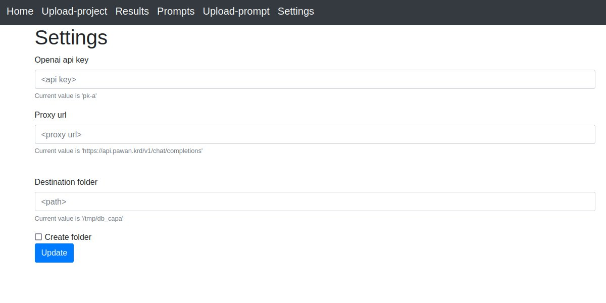
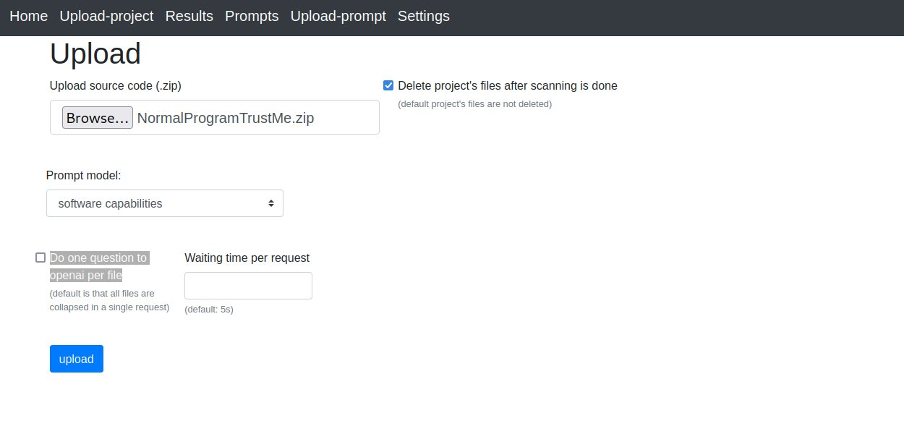
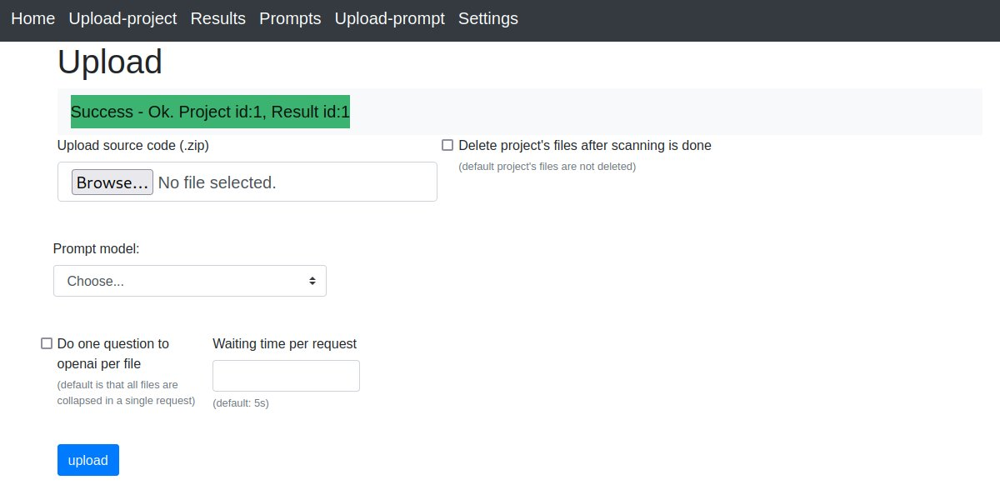
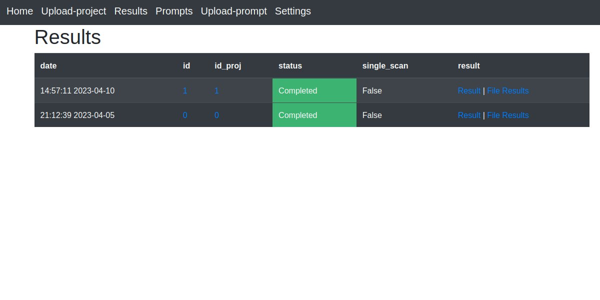
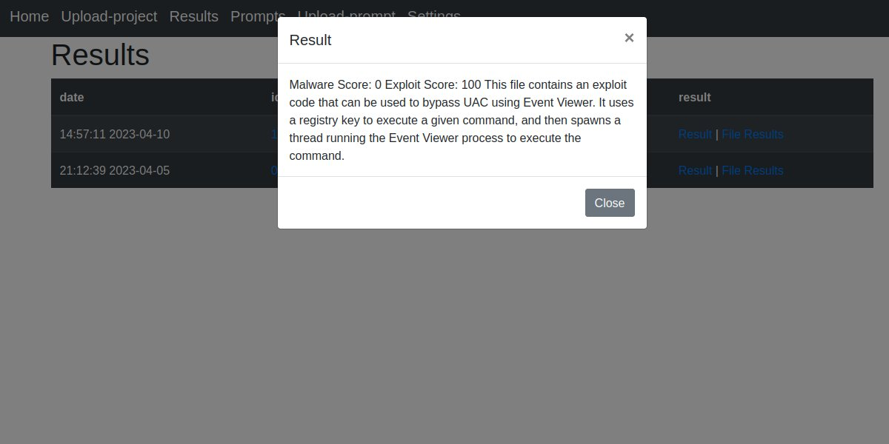
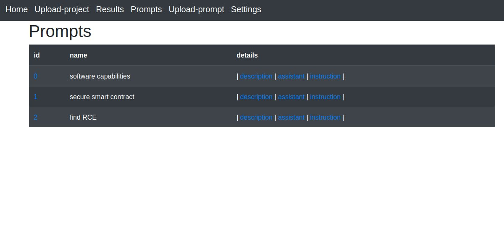

## Usage

### Step-0

First thing first, some notes:
 
 - The service does not support full OpenAI API as we do not have access to
   it, check [notes](./notes.md) section for more info, but still the tool
   does give some hook points where that functionality could be added

 - We didn't have time for code documentation, but we'll do it as soon as possible

 - Give a read to [notes](./notes.md) section as it does provide further information

 

### Next Steps

1. Update settings

Set `proxy url` and `api key`. `Destination folder` is the staging area where projects' files are saved

 -  Our web app makes the request to chatgpt by a reverse proxy which is implemented by https://github.com/PawanOsman/ChatGPT project. The reverse proxy can be hosted by yourself or you can use the proxy server which they do host, in this case you must request a key ([gist instruction](https://gist.github.com/PawanOsman/72dddd0a12e5829da664a43fc9b9cf9a)).
 - Check [notes](./notes.md) section for more info about it

 

2. Upload a project

The source code must be sent as an archive .zip, then we choose if we want to delete it after the scan is complete.
 - `Prompt model` : Select the prompt model to instruct chatgpt (how to upload a prompt model and how it works is shown here: [prompt_details](./prompt_details.md))
 - `Waiting time` : if one request to openai per file is selected (the checkbox on the left) then we also define the waiting time per request.
 - `Single request` : As default, SourceGPT will collpase each file's content into a single text splitted by the file separator (more info: [prompt_details](./prompt_details.md))

In the image below i selected the prompt "software capabilities" which does list the functionalities exposed by the software (e.g. opening a socket). The prompt was inspired by the project capa (https://github.com/mandiant/capa).

If all went good, a `Project id` and `Result id` should return. `Project id` identifies the source code project, Meanwhile `Result id` identifies the result. In future we should have the option to use an old project id instead of uploading a new one each time we need to test a new prompt model.

 

3. See scan results

Here we see the results with `status` column telling if an error occured and when the scan is completed.

`Result` column shows the results chatgpt gave to us. If a reuqest per file's content was selected then the results are shown on the `File Results` column.  Note, we can also select the id columns which will pop-up the results in raw jsons.

4. List prompt models

